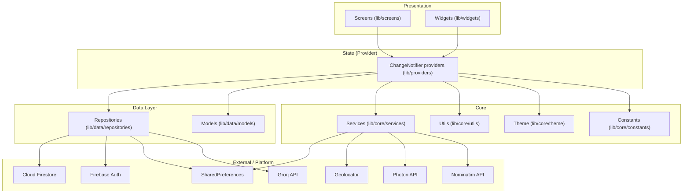
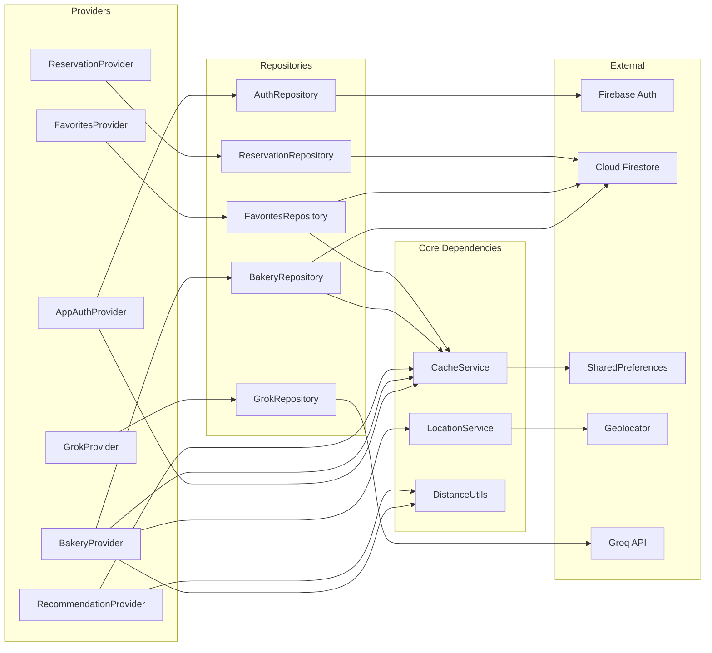
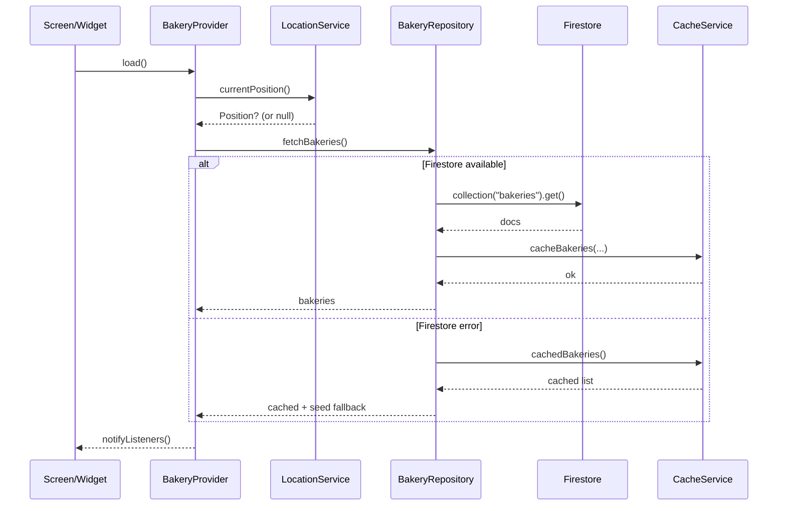
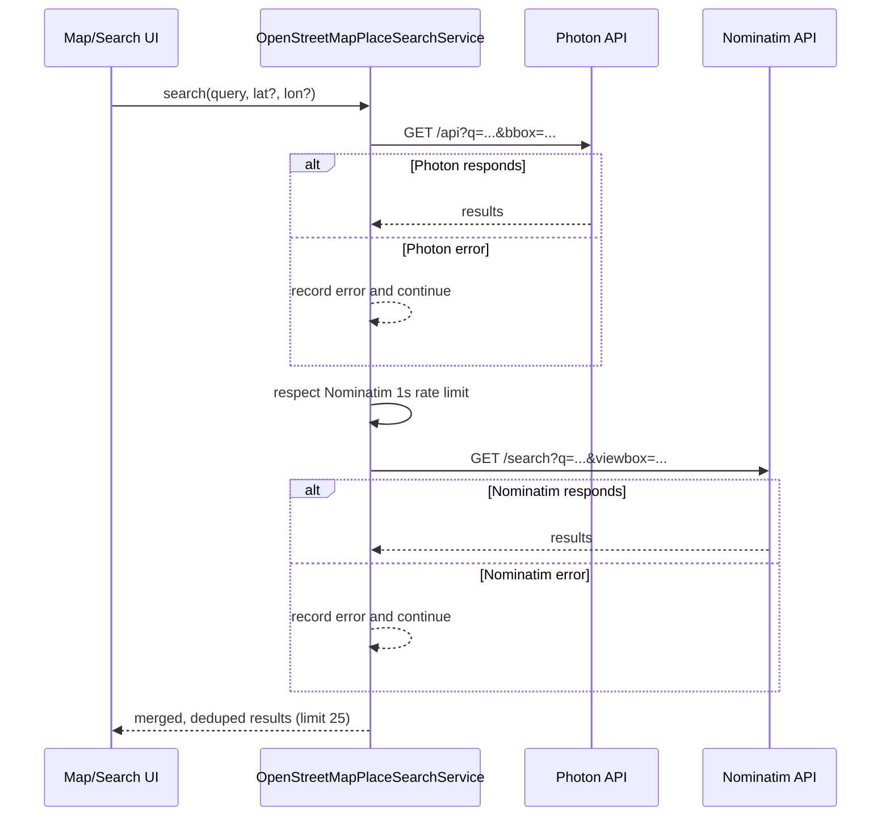
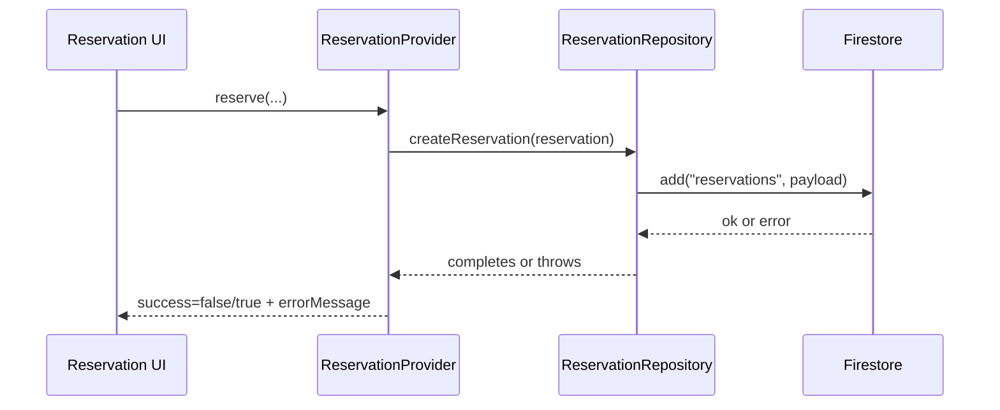

# The Pastry Path

The Pastry Path is a cafe and bakery discovery app built with Flutter, Firebase, Provider, location services, OpenStreetMap, recommendations, reservations, and bakery trend insights. It narrows the Foodie Finder brief into a pastry-focused experience for finding nearby bakeries, comparing menus, saving favorites, reading reviews, and reserving tables.

## Features

- Email/password login and signup with Firebase Auth.
- Nearby bakery discovery with category, mood, and search filters.
- Bakery detail pages with photo gallery, menu items, reviews, directions, and reservations.
- Favorites with offline caching.
- Location-aware distance calculation for Gurugram bakeries.
- Map view with OpenStreetMap on Android, iOS, and web, including place search for bakery names and areas.
- Reservation flow backed by Firestore; mock success is disabled so confirmations only appear after a real save.
- Profile review flow for rating visited cafes and bakeries.
- Insight dashboard with charts for category popularity and trend interpretation.

## Extensions Beyond Base Brief

- Personalized recommendation engine: ranks bakeries using rating, popularity, trend score, favorite categories, visited categories, and distance.
- Insight layer: charts convert bakery data into user-facing trends, helping users understand which pastry categories and venues are most popular.
- Offline-first demo behavior: cached bakeries, favorites, recently viewed items, and seed data keep the app usable when Firestore is unavailable.

## Screenshots

Add final screenshots before submission:

- `docs/screenshots/home.png` - discovery feed, search, filters, and recommendations.
- `docs/screenshots/details.png` - bakery detail page with menu and reservation button.
- `docs/screenshots/map.png` - bakery map with pins.
- `docs/screenshots/insights.png` - chart-based insight screen.
- `docs/screenshots/profile.png` - profile, review, and logout actions.

## Architecture

Mermaid diagrams render on GitHub. If you view this README elsewhere, ensure Mermaid is enabled.

### Layered Overview



### Provider To Repository Map



### Key Flows







```text
UI screens/widgets
  -> Provider state objects
    -> Repository layer
      -> Firebase Auth / Firestore / SharedPreferences / Location
```

```text
lib/
  core/
    constants/       app-wide constants
    services/        cache and location services
    theme/           custom color and typography system
    utils/           distance utilities
  data/
    models/          Bakery, MenuItem, Review, Reservation
    repositories/    Firebase and fallback data access
  providers/         Auth, bakery, favorites, recommendations, reservations
  routes/            route names
  screens/           app screens by feature
  widgets/           reusable UI components
test/
  widget_test.dart
```

## State Management

The app uses Provider with clear separation between UI and business logic:

- `AppAuthProvider`: login, signup, logout, remember-login state.
- `BakeryProvider`: loading bakeries, search filters, category/mood filters, recently viewed state.
- `FavoritesProvider`: favorite IDs and optimistic favorite toggles.
- `RecommendationProvider`: personalized ranking and smart suggestion text.
- `ReservationProvider`: Firestore reservation writes, saving state, and error messages.

Screens read state with `watch` and trigger actions through providers. Repositories keep Firebase details out of the UI.

## Firebase Collections

- `users/{uid}`: profile metadata and preferences.
- `bakeries/{bakeryId}`: structured bakery records.
- `reviews/{reviewId}`: `bakeryId`, `userName`, `rating`, `comment`, `createdAt`.
- `favorites/{favoriteId}`: `userId`, `bakeryId`, `createdAt`.
- `reservations/{reservationId}`: reservation date, time slot, guests, status.

## Sample Firestore Bakery

```json
{
  "name": "Sweet Crumbs Atelier",
  "description": "A refined patisserie with plated desserts and single-origin coffee.",
  "address": "Galleria Market, Gurugram",
  "category": "Pastries",
  "mood": "Date Spot",
  "imageUrls": ["https://images.unsplash.com/photo-1554118811-1e0d58224f24?w=1200&q=85"],
  "rating": 4.9,
  "reviewCount": 328,
  "popularity": 94,
  "trendingScore": 91,
  "latitude": 28.4675,
  "longitude": 77.0818,
  "openUntil": "11:00 PM",
  "menu": [
    {
      "name": "Pistachio Cruffin",
      "price": 260,
      "category": "Pastries",
      "imageUrl": "https://images.unsplash.com/photo-1509440159596-0249088772ff?w=800&q=85"
    }
  ]
}
```

## Recommendation Logic

The rule-based engine ranks bakeries with:

```text
score =
(rating * 0.4) +
(popularity * 0.2) +
(trending * 0.1) +
(userPreference * 0.2) +
(distanceWeight * 0.1)
```

User preference comes from favorite categories and visited category counts. Distance weight favors nearby bakeries while still allowing highly rated trending spots to rank well.

## Insight Layer

The analytics screen answers: "What should I try next?"

- Category distribution shows which bakery types dominate the available choices.
- Trending scores highlight venues with strong popularity and review signals.
- Progress indicators help users compare categories without opening every detail page.

## Offline And Edge Cases

- `SharedPreferences` caches bakery lists, favorite IDs, visited categories, recently viewed bakeries, and remember-login preference.
- If Firestore is unavailable, cached data or seed data is shown.
- Empty states are shown for no favorites and no matching search/filter results.
- Reservation errors show snackbars instead of fake success.
- Invalid login form input is blocked with field-level validation.

## Testing

Run:

```bash
flutter test
```

Coverage included:

- Widget test: login form validates invalid email/password.
- Widget test: favorite button toggles icon state.
- Widget test: empty state communicates the no-saved-bakeries edge case.
- Unit test: recommendation engine ranks favorite and high-scoring bakeries higher.

## Manual Test Scenarios

Happy path:

- Sign up or log in.
- Browse bakeries on Home.
- Search for a bakery item or category.
- Open a bakery detail page.
- Save it as favorite.
- Open map and select a bakery pin.
- Reserve a table and confirm Firestore writes successfully.
- Open Insights and review chart trends.

Edge cases:

- Submit login with invalid email/password.
- Search for a term with no matching bakeries.
- Open Favorites before saving anything.
- Disable internet or block Firestore and confirm cached/seed data appears.
- Attempt reservation when Firestore rules reject writes and confirm an error snackbar appears.

## Setup

1. Install Flutter.
2. Run `flutter pub get`.
3. Configure Firebase with FlutterFire: `flutterfire configure`.
4. Enable Firebase Auth providers in Firebase Console:
   - Email/password
   - Google (Google Sign-In)
5. Google Sign-In (Android) setup:
   - Ensure the Firebase Android app package name matches `com.example.thepastrypath` (see `android/app/build.gradle.kts`).
   - Generate SHA fingerprints for the signing key you run with (debug and later release):

     ```bash
     cd android
     ./gradlew signingReport
     ```

     On Windows PowerShell you can also run:

     ```powershell
     cd android
     .\\gradlew signingReport
     ```

   - Firebase Console -> Project settings -> Your apps -> Android -> add **SHA-1** (and ideally **SHA-256**).
   - Re-download `google-services.json` and place it at `android/app/google-services.json`.
   - Run on a real device or an emulator image with Google Play services. If you see `ApiException: 10`, the SHA-1 is missing or the config was not re-downloaded.
6. Enable Cloud Firestore.
7. OpenStreetMap/Nominatim setup:
   - No API key is required for map tiles or basic place search.
   - The app uses `flutter_map` for map rendering and Nominatim for place search.
   - For production/high traffic, host your own Nominatim instance or use a managed provider that supports OSM data.
8. Run `flutter run`.

## APK Build

```bash
flutter clean
flutter pub get
flutter build apk --release
```

The APK is generated in `build/app/outputs/flutter-apk/`.

## Deployment Readiness

- App name: The Pastry Path.
- Custom launcher icon: pastry and map-pin mark.
- Android splash screen: themed pastel background with launcher mark.
- Firebase config: included for the configured project.
- Release APK: generate with the command above.

## Challenges Faced

- Balancing Firebase-backed production structure with offline-first demo behavior.
- Keeping maps and place search reliable while respecting open-data service usage limits.
- Preventing reservation mock mode from creating false success.
- Making recommendation logic deterministic enough to test while still feeling personalized.

## AI Usage Disclosure

AI tools were used to assist with Flutter implementation, debugging, code organization, README drafting, and generated local icon assets. The app was manually reviewed and modified for the bakery/cafe niche, Provider architecture, Firebase configuration, custom UI theme, map fallback, reservation behavior, and testing requirements.
